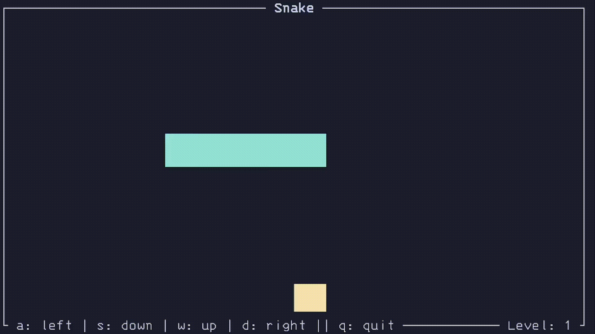

A very simple snake game in Rust

When playing with a new tool it's usually a good idea to try it out with some small project that feels famililar. Given I've tried my hands at a couple of [snake](https://github.com/flavioamieiro/snake_game) [games](https://amieiro.net/snake-1D.html) in the past, I thought I'd give it a try in Rust now.
